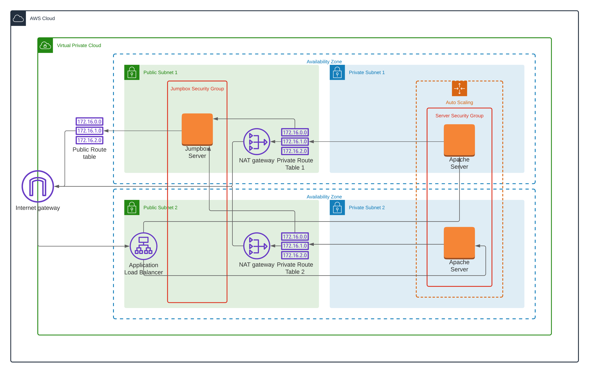

## High-Availability Web App with CloudFormation
The scripts in here can provide a basic infrastructure for deploying a simple example of what a high-availability infrastructure is.



### Provisioning the Infrastructure as a Code
##### 1. AWS account
You would require to have an AWS account and awscli in order to be able to build cloud infrastructure.

Also, open the perform.sh script and update the accountId with your details.

##### 2. Create the Infrastructure
First of all, you will need to provision the basic network. Run the following command

```
./perform.sh create network
```

Wait for the network infrastructure to be provisioned and execute the following for creating the servers:

```
./perform.sh create servers
```

Once finished, you will be able to access the server by using the Load Balancer's URL provided in the server's output

##### 3. Clean the Infrastructure
When you're finished, you can remove the provisioned infrastructure by executing the following:

```
./perform.sh delete servers
```

You will want to wait until the servers have been cleared before destroying the network. Once that's done, you just need to run a perform to delete the remaining network:

```
./perform.sh delete network
```
